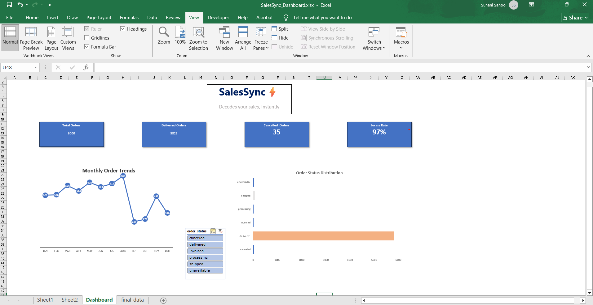
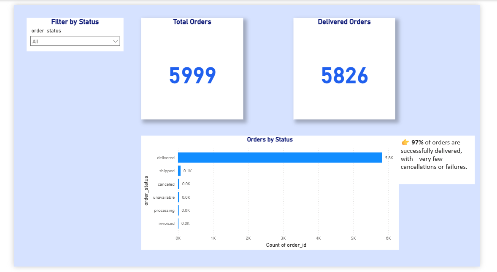
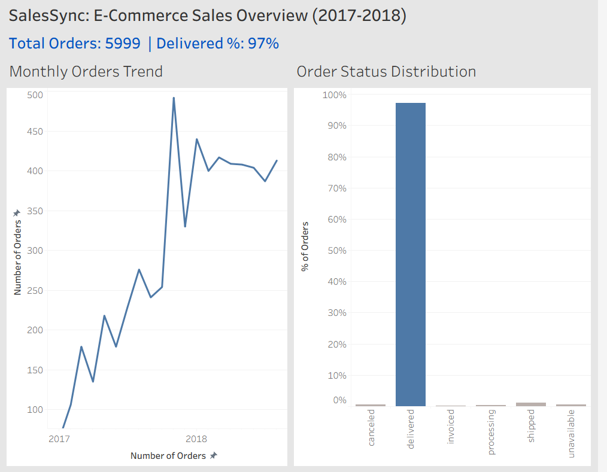

# 📊 SalesSync: Revenue Intelligence Dashboard

## 🚀 Overview  
This project analyzes e-commerce sales data to generate business insights using SQL and visualization tools.

---

## 🛠️ Tools & Technologies  
- SQL  
- Excel  
- Power BI  
- Tableau  

---

## 📂 Project Structure  
- analysis.sql → SQL queries  
- sales_dashboard_excel.png  
- sales_dashboard_powerbi.png  
- sales_dashboard_tableau.png  

---

## 🔗 Dashboard Access  
- Excel Dashboard  
- Power BI Dashboard  
- Tableau Dashboard  

---

## 📊 Key Insights  
- Revenue & sales trends  
- Customer behavior  
- Top customers by spending  
- Sales by state  
- Monthly order trends  

---

## 🎯 Goal  
To showcase end-to-end data analysis skills and business insights.

---

## 💼 Portfolio Value  
- SQL + Dashboarding  
- Real-world dataset  
- Business-focused insights  

---

## 📸 Dashboard Preview  

### Excel Dashboard  

### Power BI Dashboard  

### Tableau Dashboard  

